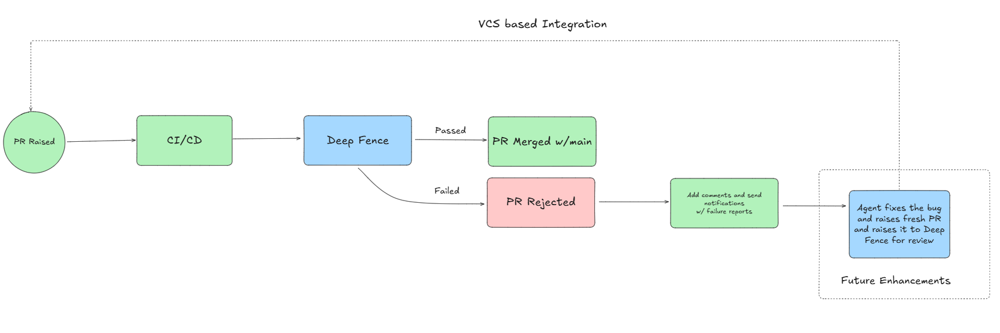
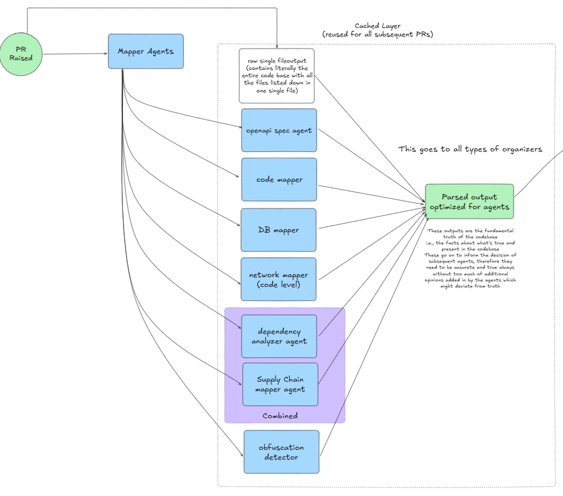
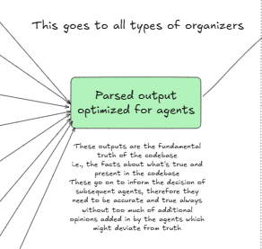
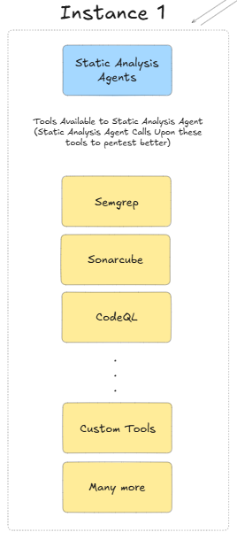
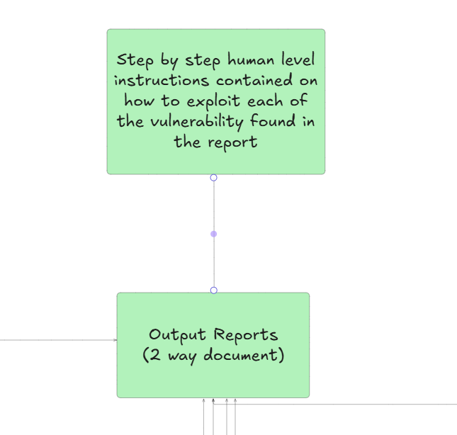

# DeepFence AI

Deepfence AI is a tool that aims to offer builders and enterprises end to end testing for their codebases. Finding all sorts of vulnereabilites across all layers of the application stack including network, database, supply chain and business logic vulnerabilities.

## DeepFence AI Architecutre 


## Eagle eye view 

We are considering 3 options of integration for the Deepfence AI

1. The first consideration is a VCS based integration which works at every possible step during the development phase of the product.


2. The other approach could be to do weekly/monthly or demand audits of the entire codebase using DeepfenceAI.

3. Custom swappable modules integration: the entire architecture is planned to be developed in such a way that eachn of the module/agent can be integrated seperately as per the need of the user

## Detailed Walkthrough

1. Trigger Event: could be a PR to main/on demand request for audit

2. Mapper Agent: This would trigger the first step in the entire process. This is a cached layer which can be used later on for further trigger events to reduce the time and cost of analysis.

The purpose of mapper agents is to create source of truth documents about the codebase. The output of mapper agents is passed down to other subsequent agents. The accuracy of the these documents affect the functioning of the agents down the line 



## Mapper Agents List:

1. Openapi specification agent(Done) - This agent is responsible for scanning the entire codebase and generating an openapi spec file. Openapi spec file contains details of all the endpoints in a codebase irrespective of the underlying programming language or framework that is used.

Sample output of openapi spec file:

```yaml

openapi: 3.0.0
info:
  title: Sample To-Do API
  version: 1.0.0
  description: A simple API to manage to-do items.

servers:
  - url: https://api.todoapp.com/v1
    description: Production server

paths:
  /todos:
    get:
      summary: Get all to-do items
      responses:
        '200':
          description: A list of to-do items
          content:
            application/json:
              schema:
                type: array
                items:
                  $ref: '#/components/schemas/Todo'

    post:
      summary: Create a new to-do item
      requestBody:
        required: true
        content:
          application/json:
            schema:
              $ref: '#/components/schemas/Todo'
      responses:
        '201':
          description: To-do item created

  /todos/{id}:
    get:
      summary: Get a single to-do item by ID
      parameters:
        - name: id
          in: path
          required: true
          schema:
            type: integer
      responses:
        '200':
          description: A single to-do item
          content:
            application/json:
              schema:
                $ref: '#/components/schemas/Todo'
        '404':
          description: To-do not found

components:
  schemas:
    Todo:
      type: object
      properties:
        id:
          type: integer
          example: 1
        title:
          type: string
          example: Buy groceries
        completed:
          type: boolean
          example: false

```

2. Raw one file script(Done) - The output is a single file literally containing all codebases files in one single file.

3. DB mapper agent(Done) - This agent does a scans of the entire software repositories to discover, and analyze all database-related artifacts. It provides intelligent detection of connection strings, ORM models, raw SQL queries, hardcoded secrets, migration files, schema changes, and generates natural language security reports with actionable recommendations.

4. Network mapper agent(Done) - **Network Mapper** is a static-analysis scanning tool focused on **network-related code artifacts** inside a repository. It examines source files, configuration, deployment manifests and scripts to detect:

* Outbound network calls (HTTP(S), WebSockets, gRPC, GraphQL, raw sockets, etc.)
* Inbound bindings and exposed ports (server.listen, socket.bind, container ports)
* CORS configurations and potential misconfigurations
* Hardcoded URLs, IPs, secrets or credentials used for network calls
* Environment variables, config files and templates that define endpoints
* Patterns in third-party libraries (e.g., axios, requests, fetch) and generated code

Output is a comprehensive JSON report with structured `signals`, metadata and summary statistics. The system is modular — detectors are pluggable, language parsers are separable, and rulesets are user-extensible.

5. Supply Chain mapper Agent(Done) - The **Supply Chain Mapper** is a static analysis tool that scans entire repositories to identify all **dependencies**, **manifests**, and **potential supply chain attack surfaces**. This tool focuses entirely on the **Mapper layer**, providing a **highly modular, extensible base system** that are with special agent which have integrations with tools like `socket.dev`, `Snyk`, `Trivy`, or custom scanners.

The mapper performs comprehensive **cross-language dependency and metadata mapping** by:
- Recursively scanning code repositories
- Identifying all dependency-related files and manifests
- Extracting, normalizing, and outputting structured JSON data
- Computing lightweight **risk signals** (static heuristics) for each dependency
- Producing a consolidated JSON output file for downstream consumption

6. Obfuscation Detector(Done) -  The Obfuscation Checker Agent is a designed to detect intentional obfuscation techniques in codebases. It employs advanced algorithms including entropy analysis, AST-based parsing, machine learning-inspired heuristics, and comprehensive malware signature detection to identify potentially malicious or suspicious code. The aim is to detect this kind of attempts early on in the mapper layer itself to be analyzed further down by special agents.

7. Code Mapper Agent(To be made) - This agent is responsible for creating a high level map of the entire codebase. The output of this agent is a document which contains details of all the modules, functions, classes and their interactions in the codebase. This document is created using static analysis and LLMs to create a high level map of the entire codebase.

## Parsed Mapper Output

The output of all the mapper agents are combined into a single parsed output which is optimized for use for **organizer agents** in the following steps 

The parsed output document needs to be something that is:
1. optimized for use by agents
2. represent the fundamental truths about the codebase and do not include additionally added in opinions which deviate from the truth




## Organizers

Organizer agents are the responsible for taking the parsed output from the mapper agent and using it to run various runs of specialized agents to find vulnerabilities across various layers of the application stack.

The various organizer agents are:
1. Static Analysis Organizer
2. Dynamic Analysis Organizer
3. Secret Scanner Organizer
4. Interactive Application Security Testing Organizer 
5. Software Composition Analysis Organizer
6. Business Logic Analysis Organizer
7. Network Security Analysis Organizer
8. Database Security Analysis Organizer
9. Supply Chain Security Analysis Organizer

### Detailed Walkthrough of Static Analysis Organizer

Static Analysis Organizer is responsible for taking the parsed output from the mapper agents and using it to run various static analysis runs to find vulnerabilities in the codebase. 


The static analysis organizer passes the input to the static analysis agent:
1. This agent has the ability to use the input from the mapper agents and using that make various tools calls to static analysis tools like:
- Semgrep
- Bandit
- Brakeman
- Findsecbugs
- Custom Toolings

2. Static Analysis agent passes the result of these output to the organizer agent which passes it to the reporting organizer.



## Reporting Organizer
The reporting organizer is responsible for taking the output from all the organizer agents and compiling it into a single report which is then passed on back to the organizer agent which now will have context from other organizer agents as well.

Now the organizer agents will trigger the second round of analysis and use the information collected from the first round of analysis to perform deeper analysis of the codebase.

Finally all the output from all the organizer agents is passed on to the reporting agent which compiles it into a single report.



## Final Report

The final report is a comprehensive document which contains all the vulnerabilities found in the codebase across all layers of the application stack. The report is divided into various sections based on the type of vulnerability and contains detailed information about each vulnerability along with recommendations for fixing them. 

The report also contains a step by step guide for remediating the vulnerabilities found in the codebase. It also contains step by step instructions on how to replicate the findings locally.

--- 

Note: section below is genrated using AI and some parts are still under planning and are not finialized yet. 

## Monetization Strategy

To balance open-source accessibility with sustainable business growth, DeepFence AI adopts a hybrid model where the core foundational components are open-sourced, empowering the developer community and fostering innovation, while premium features and enterprise-grade capabilities are monetized through subscriptions and services. This approach ensures that individuals, small teams, and open-source projects can benefit from the tool at no cost, while enterprises can access advanced functionalities tailored to their needs.

### Open-Source Components
A substantial portion of DeepFence AI is made available under an open-source license (e.g., Apache 2.0 or MIT), including:
- **Mapper Agents:** All core mapper agents (e.g., OpenAPI Specification Agent, Raw One-File Script, DB Mapper Agent, Network Mapper Agent, Supply Chain Mapper Agent, Obfuscation Detector, and the planned Code Mapper Agent) are fully open-source. This allows developers to run basic scans, generate foundational documents, and contribute to the project's evolution.
- **Basic Organizers:** Static Analysis Organizer, Secret Scanner Organizer, and Software Composition Analysis Organizer are open-source, enabling community-driven improvements and integrations with free tools like Semgrep, Bandit, and Trivy.
- **Core Framework and Architecture:** The underlying modular architecture, including the trigger event system, parsed mapper output processing, and basic reporting structures, is open-source to encourage extensibility and collaboration.

By open-sourcing these elements, DeepFence AI positions itself as a community-driven platform, attracting contributions, building trust, and accelerating adoption in the developer ecosystem.

### Monetization Opportunities
While the core remains free and open-source, revenue is generated through premium offerings that provide added value for larger organizations, teams requiring advanced features, or users needing professional support:

1. **SaaS Platform (Subscription-Based):**
   - Offer a cloud-hosted version of DeepFence AI where users can upload codebases for automated, on-demand audits. Pricing tiers could include:
     - **Free Tier:** Limited scans (e.g., small codebases, basic reports) to attract users and demonstrate value.
     - **Pro Tier:** Unlimited scans, access to all organizer agents (including Dynamic Analysis, Interactive Application Security Testing, Business Logic Analysis, etc.), and enhanced reporting with actionable insights.
     - **Enterprise Tier:** Custom integrations, real-time CI/CD pipeline hooks, compliance-specific reports (e.g., for SOC 2, GDPR, HIPAA), and priority support.
   - Charge based on codebase size, scan frequency, or number of users (e.g., $9/month for individuals, $49/month per user for teams, $999/month for enterprises).

2. **Premium Organizer Agents and Modules:**
   - While basic organizers are open-source, advanced or specialized ones (e.g., Dynamic Analysis Organizer, Network Security Analysis Organizer, Database Security Analysis Organizer, Supply Chain Security Analysis Organizer) could be offered as paid add-ons. Users can purchase individual modules or bundles.
   - Introduce custom-built agents for niche needs (e.g., blockchain security, IoT vulnerabilities), sold as licensed plugins.

3. **Enhanced Reporting and Analytics:**
   - The Reporting Organizer is open-source for basic functionality, but premium versions could include AI-powered remediation suggestions, historical trend analysis, risk scoring dashboards, and exportable compliance reports.
   - Monetize through subscription add-ons, such as advanced visualization tools (e.g., interactive graphs via integrations with tools like Grafana) or automated report generation in formats like PDF, JSON, or CSV with branding.

4. **API and Integrations:**
   - Provide open-source SDKs and APIs for self-hosted deployments, but charge for cloud API usage (e.g., per API call or data volume). This allows businesses to integrate DeepFence AI into their workflows without hosting costs.
   - Offer paid integrations with popular platforms (e.g., GitHub, GitLab, Jenkins, Slack) for automated triggers and notifications.

5. **Professional Services and Support:**
   - Offer consulting services for custom agent development, integration assistance, or tailored security audits.
   - Provide premium support packages (e.g., 24/7 chat, dedicated account managers) and training programs for enterprise clients.
   - Sell access to a marketplace of community-contributed agents, where verified or enterprise-grade modules are available for a fee.

6. **Data-Driven Insights and Marketplace:**
   - Aggregate anonymized vulnerability data from open-source scans to create industry benchmarks and insights, sold as premium reports (e.g., "State of Application Security 2025").
   - Build a marketplace for third-party tools and agents, taking a commission on transactions.

### Ensuring Sustainability and Community Alignment
- **Transparency and Governance:** Maintain an open governance model with a community advisory board to guide development and ensure the open-source portions remain robust.
- **Funding from Premium Users:** Revenue from enterprise subscriptions can fund ongoing development, bug fixes, and enhancements to the open-source core.
- **Incentivizing Contributions:** Offer rewards (e.g., free premium access) for top contributors to the open-source repository, encouraging a vibrant ecosystem.
- **Ethical Considerations:** Ensure that critical security features remain accessible to non-profits, educational institutions, and open-source projects at no cost to promote widespread security improvements.

This monetization strategy allows DeepFence AI to scale as an open-source leader in application security testing while generating revenue to support long-term innovation and sustainability.