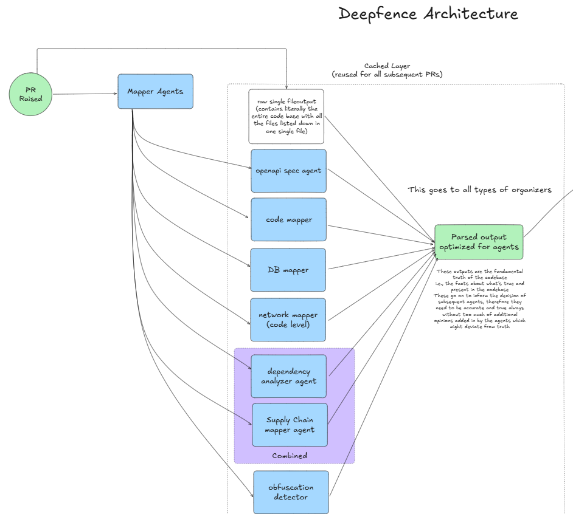

# Mapper Agent

This directory contains the Mapper Agent, which is responsible for coordinating between various mapping agents and resulting in a unified mapped output.

## Overview
The mapper agent is triggered after an event and collects data from multiple mapping agents. It processes this data to create a comprehensive map that integrates inputs from all sources which then gets passed on to the next stage in the pipeline. i.e., the organizer agents.

## Components
- **openapi mapper agent** - Created openapi spec file for a given codebase
- **code mapper agent** - Created code map for a given codebase
- **DB mapper agent** - Created database schema/ORM map for a given codebase
- **Network mapper agent** - Created network architecture map for a given codebase
- **Supply Chain mapper agent** - Created supply chain map for a given codebase
- **Obfuscation detector agent** - Detects obfuscation techniques used in the codebase to weed out threats

## Results
The output of the mapper agent is a unified mapped output that combines the results from all individual mapping agents. This output is structured to facilitate further analysis and processing by the organizer agents.